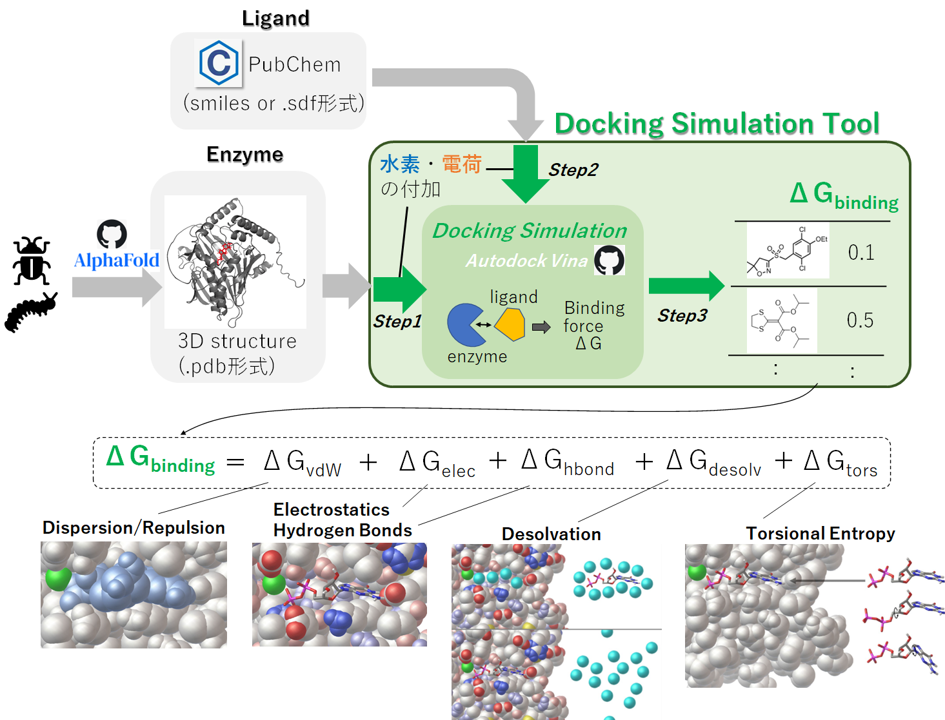
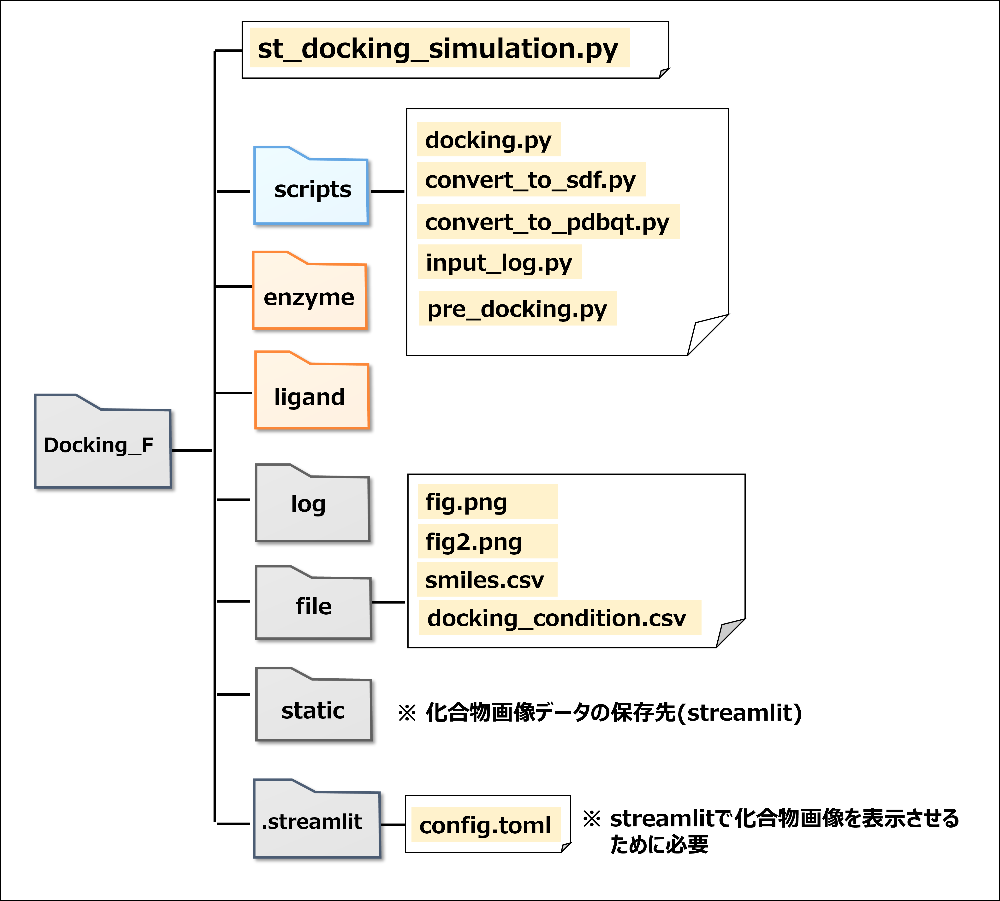
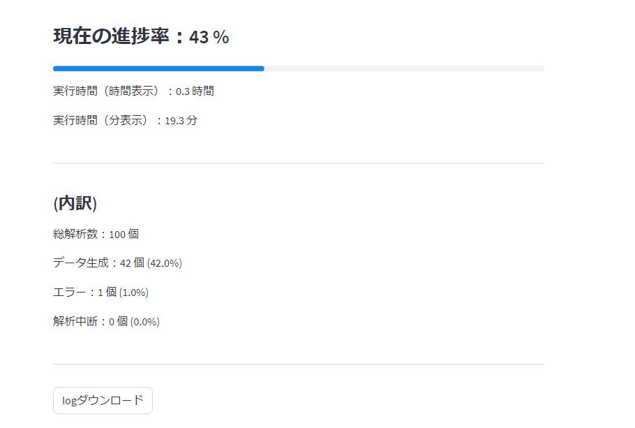
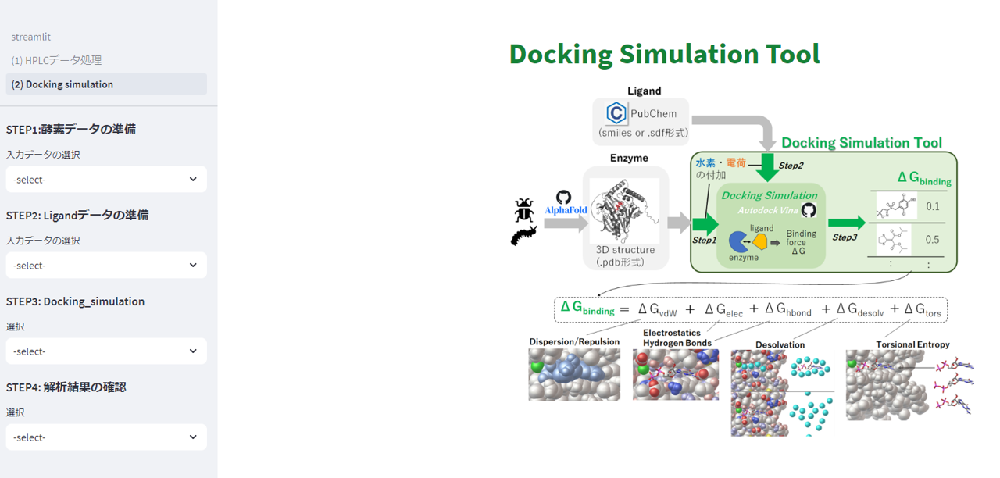

# Docking_simulation
autodock_vinaによるドッキングシミュレーション

## 1. 背景
・近年、医薬品開発において、構造ベース創薬（SBDD：Structure-Based Drug Design）が盛んに検討されている
・農薬開発においても、SBDDを用いた活性本体の探索が検討されている
・Docking_simulationはオープンソースである[autodock vina](https://github.com/ccsb-scripps/AutoDock-Vina)をベースに構成している。

## 2. 仕組み
・インプットデータは酵素3Dデータ（.pdb）とLigandデータ(smiles)
・Docking_simulation内で酵素、Ligandデータに水素、電荷を付加
・酵素の位置情報は固定した上でLigandのポージングを様々に変化させた場合の自由Eを計算し、自由Eが最小値を探索

## 3. 環境構築
(1) Conda環境設定

`conda create -n docking python`

`conda activate docking`

(2) 基本環境

`conda install -c conda-forge numpy swig boost-cpp sphinx sphinx_rtd_theme xlsxwriter`

`conda install -c conda-forge xlsxwriter`

`pip install pandas`

`pip install streamlit`

`pip install streamlit-aggrid`

`pip install rdkit`

(3) Docking_simulation tool

`pip install vina`

`conda install -c conda-forge openbabel`

`pip install oddt`

`pip install pubchempy`

## 4.フォルダ構造

・Docking_simulationはフォルダ構造に依存するため下図の通りにフォルダ作成する必要あり

・gitの「Docking_S」フォルダをダウンロードして使用を推奨

## 5.使用方法

(1) 作業環境構築

・gitから「Docking_F」フォルダをダウンロード

(2) streamlit起動

・Docking_Fフォルダ下で、下記コマンドを実行（local_hostが立ち上がる）

`conda activate docking`

`streamlit run st_docking_simulation.py`

(3) 酵素データの準備

 ・サイドバーのSTEP１ 酵素データの準備から、酵素の３次元データの拡張子を選択（.mol2もしくは.pdb）
 
 ・Docking_F/enzymeに酵素の３次元データを保存

 ・「変換開始」ボタンを押すと、2)ファイル名と同じフォルダが生成し、その下に水素および電荷付加したファイル(.pdbqt)が保存

(4) Ligandデータの準備
 
 ・サイドバーのSTEP2 Ligandデータの準備から、ligandデータのファイル型を選択（smilesもしくは.sdf）

 ・(smilesの場合)　[smilesデータリスト](./Docking_F/file/smiles.csv)（nameとsmiles列を持つcsvファイル）を作成、streamlit上にupload

 ・複数のligandデータをひと纏めに保存するためのフォルダー名を指定

 ・「変換開始」ボタンを押すと、3)で指定したフォルダが生成し、その下に水素および電荷付加したファイル(.pdbqt)が保存

 (5) Docking simulationの準備

 ・サイドバーのstep3 Docking_simulationから、「条件設定」を選択

 ・ドッキング条件を記載した[csvファイル](./Docking_F/file/docking_condition%20.csv)をstreamlit上にアップロード

 ・プルダウンから該当する酵素を選択し、保存ボタンを押す

 (6) Docking simulation
 
  ・サイドバーのstep3 Docking_simulationから、「解析」を選択

  ・出力ファイル名を入力

  ・プロセス条件を設定（同時実行するプロセス数：1~100、個々のドッキング解析にかける上限時間）

  ・ドッキングに使用する酵素、リガンドを選択

  ・開始ボタンを押し、ドッキングシミュレーションを開始

  (7) 進捗状況の確認

  ・サイドバーのstep3 Docking_simulationから、「進捗確認」を選択

  ・プルダウンから解析データを選択

  ・(6)で設定した解析時間の上限時間を入力　※実行時間の計測に使用

  ・解析状況の確認を押し、進捗状況を確認

  ・

## 6. 作業画面（フロント）

